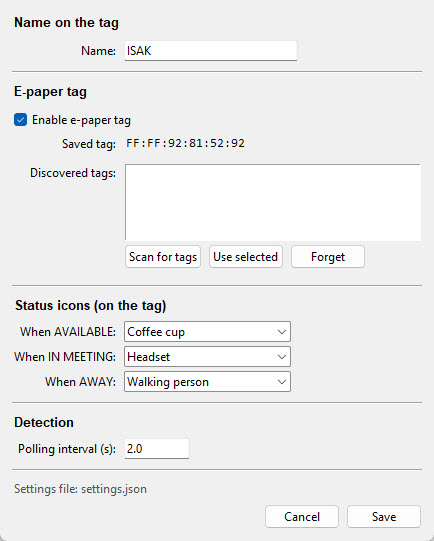

# MeetingStatus-E-Ink

Automatically shows whether you are **available** or **in a meeting** on a small
Bluetooth e-paper tag — driven by your PC's microphone and camera activity.

When any app starts using your microphone or camera (Teams, Zoom, Meet, Webex,
Slack, Discord, and so on), the program flips your status to **IN MEETING**.
When nothing is using them, it shows **AVAILABLE**. The status is displayed both
as a colored dot in the Windows system tray and on a Gicisky / PICKSMART e-paper
shelf-label tag over Bluetooth Low Energy.

> Windows only. Everything is in a single Python file — no separate driver needed.



---

## Features

- **Automatic detection** of mic/camera usage via the Windows registry — works
  with any meeting or call app.
- **E-paper tag display** showing your name on top and your status below, with:
  - a colored **frame** around the whole tag (black when available, red when in a meeting)
  - an optional **status icon** beside the text, chosen separately for each state
- **System tray dot**: green when available, red when busy, gray on startup.
- **Battery-friendly**: the tag is only rewritten when your status actually
  changes — not on every poll. (E-paper takes ~15–20 s per update and only draws
  power while updating.)
- **Simple pairing** from the Settings dialog: scan, select, save.
- Settings stored in a plain `settings.json` next to the program.

---

## Hardware

A Gicisky / PICKSMART **2.9" BWR** e-paper price tag (black/white/red),
296×128 pixels, Bluetooth Low Energy. It advertises as `NEMRxxxxxxxx` and has a
Bluetooth address of the form `FF:FF:xx:xx:xx:xx`.

Although some listings call it a "4-color / BWRY" tag, the units used here behave
as a black/white/red panel and are driven with the BWR dual-plane image format.

**Purchased from AliExpress:**
[1 Set 4 Colors 2.9'' Eink Screen Price Tag — Price Display Shelf Label ESL Digital Price Tag](https://www.aliexpress.com/item/1005002766306867.html)

---

## Status icons

Icons are drawn in code as clean single-color symbols, so they look right on
e-paper. You pick one for each state (or none).

**When AVAILABLE:** Check · Thumbs up · Coffee cup · Filled dot · Smiley
**When IN MEETING:** Speech bubble · Video camera · Headset · Phone · Video / play

---

## Install and run

### Option A — the ready-made executable

Download **`MeetingStatus.exe`** and double-click it. The settings file, log, and
help file are created automatically next to it on first run.

> Some antivirus tools show a false positive for PyInstaller-built `.exe` files.
> Approve it manually if your scanner flags it.

### Option B — run the Python script

Requires Python 3.10+.

```bash
pip install pystray Pillow bleak
python MeetingStatus.py
```

### Build the .exe yourself

If you'd rather build your own executable from the source instead of using the
provided `MeetingStatus.exe`, you can do that with [PyInstaller](https://pyinstaller.org/).

**1. Install Python 3.10+** and make sure it's on your PATH.

**2. Install the dependencies and PyInstaller:**

```bash
pip install pystray Pillow bleak pyinstaller
```

**3. Open a terminal in the folder containing `MeetingStatus.py` and run:**

In **PowerShell** (use the backtick `` ` `` for line breaks) or simply put it all
on one line:

```powershell
python -m PyInstaller --onefile --noconsole --name MeetingStatus `
    --hidden-import=PIL._tkinter_finder `
    --collect-all pystray --collect-all PIL --collect-all bleak `
    MeetingStatus.py
```

In **Command Prompt (cmd)** use `^` for line breaks:

```bat
python -m PyInstaller --onefile --noconsole --name MeetingStatus ^
    --hidden-import=PIL._tkinter_finder ^
    --collect-all pystray --collect-all PIL --collect-all bleak ^
    MeetingStatus.py
```

The finished file appears at **`dist\MeetingStatus.exe`**.

**What the flags do:**

| Flag | Purpose |
|------|---------|
| `--onefile` | Bundle everything into a single `.exe` (no loose files) |
| `--noconsole` | No black console window — it's a background app |
| `--name MeetingStatus` | Name of the output file |
| `--hidden-import=PIL._tkinter_finder` | Needed so the Settings dialog (tkinter) works |
| `--collect-all pystray / PIL / bleak` | Bundle all submodules so the tray icon and Bluetooth work |

> **Note:** Some antivirus tools (including Windows Defender) show a false positive
> for PyInstaller-built executables. This is common and harmless — approve the file
> manually, especially before sharing it with colleagues.

---

## First-time setup

1. **Wake the tag** by removing and reinserting a battery (it only advertises
   for a short while after waking).
2. Right-click the tray icon and choose **Settings…**
3. Tick **Enable e-paper tag**, then click **Scan for tags**.
4. Select your tag in the list (e.g. `NEMR92815292`) and click **Use selected**.
5. Type your name in the **Name** field.
6. Choose icons for **AVAILABLE** and **IN MEETING** if you like.
7. Click **Save**.

The program remembers the tag's address and reconnects automatically next time.

To start it automatically at login, press `Win+R`, type `shell:startup`, and put
a shortcut to the program in the folder that opens.

---

## Tray menu

| Item | What it does |
|------|--------------|
| **Status** | Current mode: AVAILABLE, IN MEETING or OFF |
| **Source** | Which app triggered "busy" (e.g. `Teams.exe`) |
| **Tag** | Tag state: ready, writing…, or off |
| **Settings…** | Open the settings window |
| **Update tag now** | Force an immediate redraw of the tag |
| **Setup help** | Open the built-in help text |
| **Quit** | Exit the program |

---

## Notes

- **Mute is still "in a meeting".** When you mute in Teams/Zoom/etc., the app
  keeps the microphone open at the OS level, so you'll still show as IN MEETING.
  The only undetected case is muted + camera off + only listening.
- **Tag looks rotated, mirrored, or wrong color?** Adjust the `PANEL_` constants
  at the top of `MeetingStatus.py` (`PANEL_ROTATION`, `PANEL_INVERT_BW`,
  `PANEL_INVERT_RED`).
- **No Bluetooth on the PC?** Most laptops have it built in; many desktops do not.
  A cheap USB Bluetooth dongle works.

---

## Documentation

A full illustrated user manual is included: **`Meeting_Status_Manual.pdf`**.

---

## Files in this repository

| File | Description |
|------|-------------|
| `MeetingStatus.py` | The complete program (single file) |
| `MeetingStatus.exe` | Ready-to-run Windows executable |
| `Meeting_Status_Manual.pdf` | Full user manual |
| `Image.jpg` | Screenshot of the settings window |

---

## Credits

Software developed by **SA7BNB, Anders Isaksson**.

The e-paper BLE protocol is based on reverse-engineering work by
[atc1441](https://github.com/atc1441/ATC_GICISKY_ESL) and
[eigger/hass-gicisky](https://github.com/eigger/hass-gicisky).

---

## License

Released under the MIT License — see below.

```
MIT License

Copyright (c) 2026 Anders Isaksson (SA7BNB)

Permission is hereby granted, free of charge, to any person obtaining a copy
of this software and associated documentation files (the "Software"), to deal
in the Software without restriction, including without limitation the rights
to use, copy, modify, merge, publish, distribute, sublicense, and/or sell
copies of the Software, and to permit persons to whom the Software is
furnished to do so, subject to the following conditions:

The above copyright notice and this permission notice shall be included in all
copies or substantial portions of the Software.

THE SOFTWARE IS PROVIDED "AS IS", WITHOUT WARRANTY OF ANY KIND, EXPRESS OR
IMPLIED, INCLUDING BUT NOT LIMITED TO THE WARRANTIES OF MERCHANTABILITY,
FITNESS FOR A PARTICULAR PURPOSE AND NONINFRINGEMENT. IN NO EVENT SHALL THE
AUTHORS OR COPYRIGHT HOLDERS BE LIABLE FOR ANY CLAIM, DAMAGES OR OTHER
LIABILITY, WHETHER IN AN ACTION OF CONTRACT, TORT OR OTHERWISE, ARISING FROM,
OUT OF OR IN CONNECTION WITH THE SOFTWARE OR THE USE OR OTHER DEALINGS IN THE
SOFTWARE.
```
